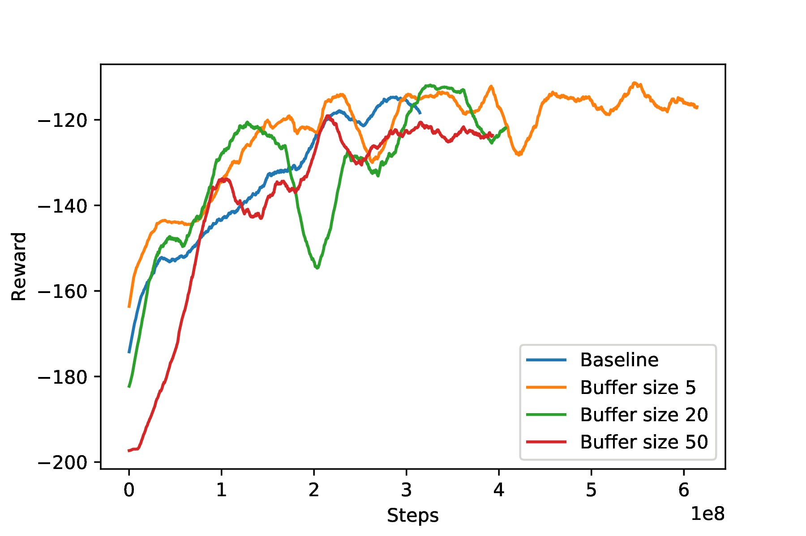
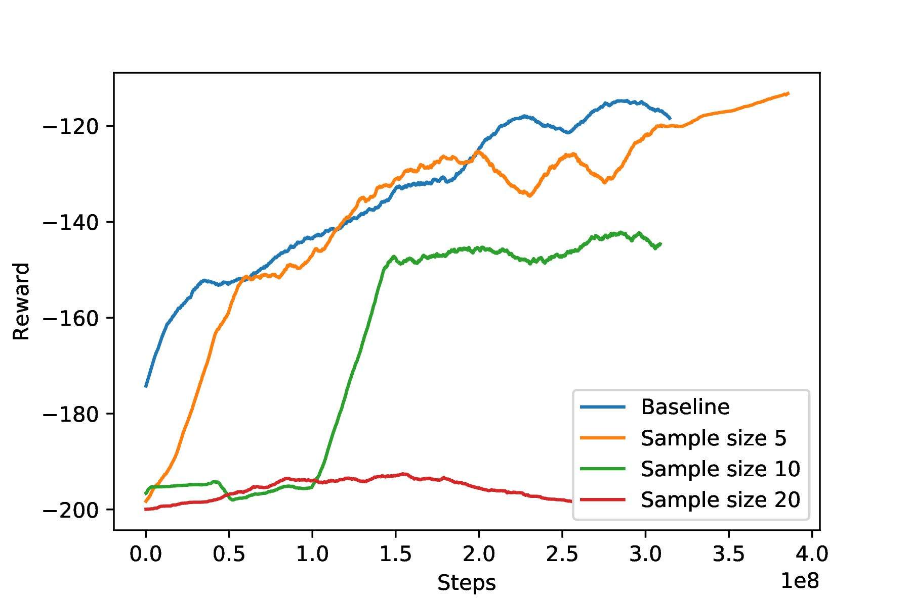
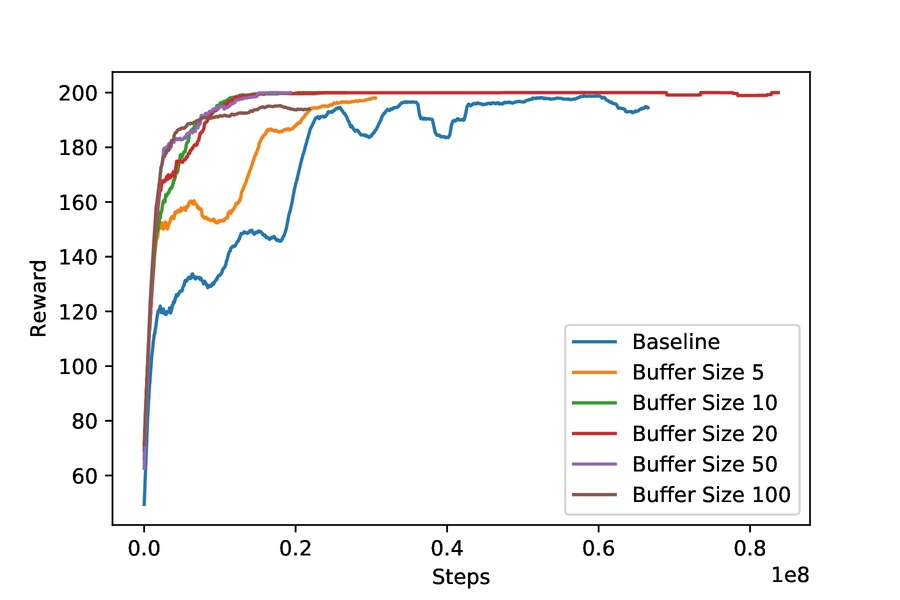
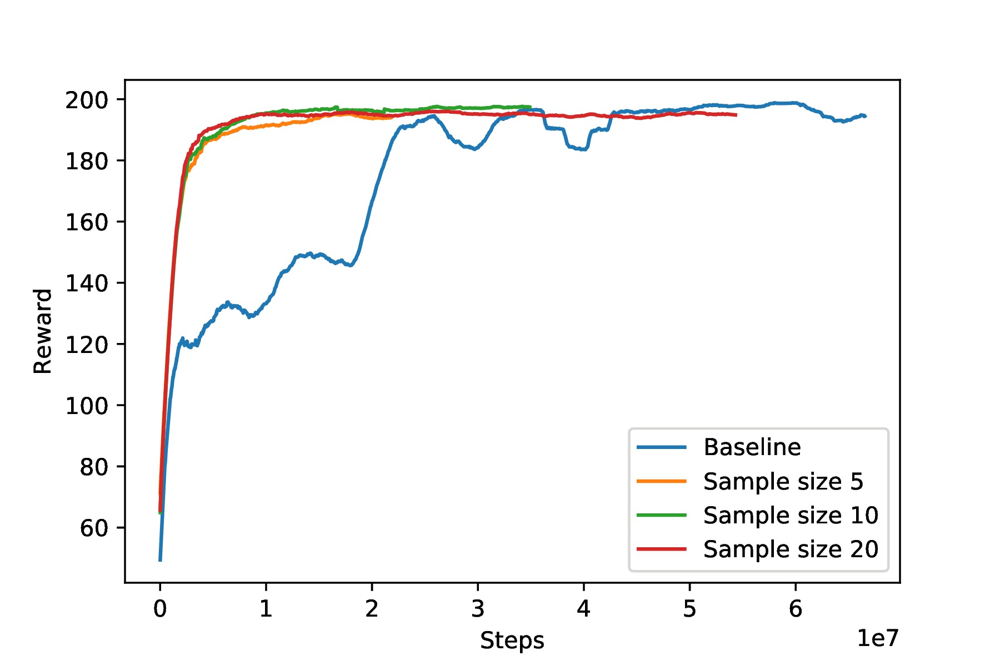

# **A2C_experience_repaly** #
- - -
## **Introduction** ##
Implemented A2C algorithm with experience replay

## **Result** ##
## MountainCar-v0 ##  
  
  
  
## CartPole-v1-v0 ##
  
  
   
###[Video](https://www.youtube.com/watch?v=mIvstl3QufM)###
###[Report](https://drive.google.com/file/d/1md8jDYBwizvwJi0ZLNM8QnIsN7h0qIHq/view?usp=sharing)###

## **Environment** ##
Install and run docker with ```sudo docker run -it fraserlai/276_project:gym_10_TA_v6 /bin/bash```

## **Requirements** ##
* Python 3
* PyTorch
* OpenAI baselines
* Anaconda

## **Run** ##
Open and run *main_experience_replay.ipynb*