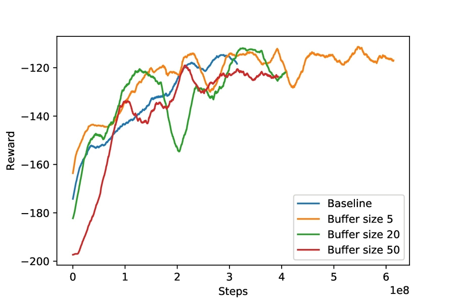
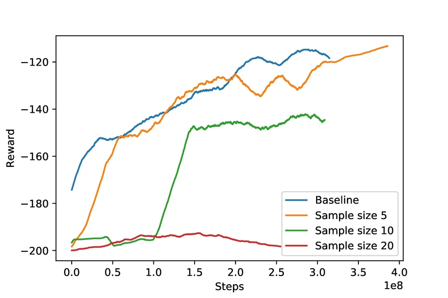
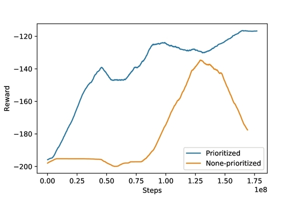
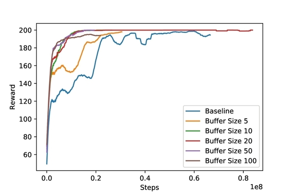
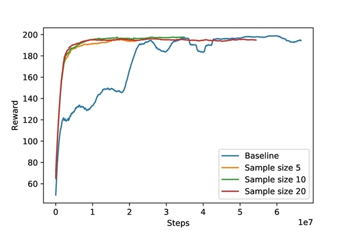
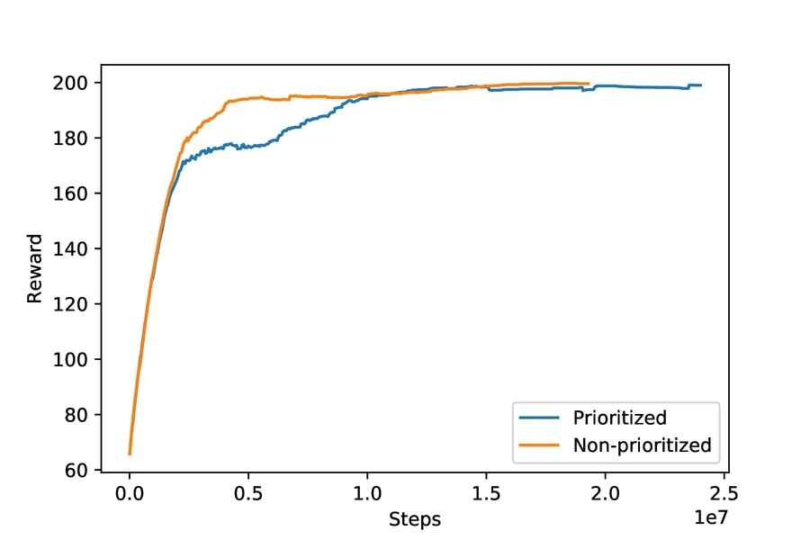

# **A2C_experience_repaly**
- - -
## **Introduction**
* ### Implemented A2C algorithm with experience replay

## **Results**
* ### A2C algorithm WITHOUT experience replay is the baseline
* ## MountainCar-v0  
     * ### Different replay buffer size
     
     * ### Different sample number  
  
     * ### Different sample number  
  
     * ### Prioritized or not  
  
* ## CartPole-v1  
     * ### Different replay buffer size  
  
     * ### Different sample number  
  
     * ### Prioritized or not  
  
* ## Please see the video or the report for more results
     * ### Video (Click the image below to play on YouTube)  
     [](http://www.youtube.com/watch?v=mIvstl3QufM)
     * ### [Report](https://drive.google.com/file/d/1md8jDYBwizvwJi0ZLNM8QnIsN7h0qIHq/view?usp=sharing)

## **Environment**
* ### Install and run docker with ```sudo docker run -it fraserlai/276_project:gym_10_TA_v6 /bin/bash```

## **Requirements**
* ### Python 3
* ### PyTorch
* ### OpenAI baselines
* ### Anaconda

## **Run** ##
* ### Open and run *main_experience_replay.ipynb*

## **Reference** ##
* ### [openai baseline](https://github.com/openai/baselines/tree/master/baselines/a2c)
* ### [ikostrikov pytorch-a2c-ppo-acktr](https://github.com/ikostrikov/pytorch-a2c-ppo-acktr)
